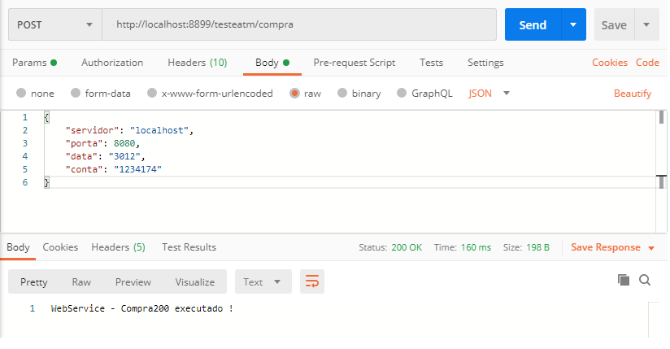

# Projeto para testes TOPAZ 

# Iniciar o servidor 
 Fazer o download do arquivo "mensagem.jar" - na pasta /build, após clicar duaz vezes neste arquivo para executar, para conferir se subiu podemos olhar no Gerenciador de Tarefas 

# Finalizar o servidor 
   Abrir o Gerenciador de Tarefas e clicar no botão "Finalizar Tarefa" na tarefa Java, como mostra a imagem.
   

# Executando as chamadas
  Criar uma chamada rest(POST) para o endereço - http://localhost:8080/api/mensagem/compra200, criar um objeto no body com os parâmetros  
  {
  	"servidor": "localhost",
    "porta": 8080,
    "data": "3012",
    "conta": "1234157"
  }
  
 
  
