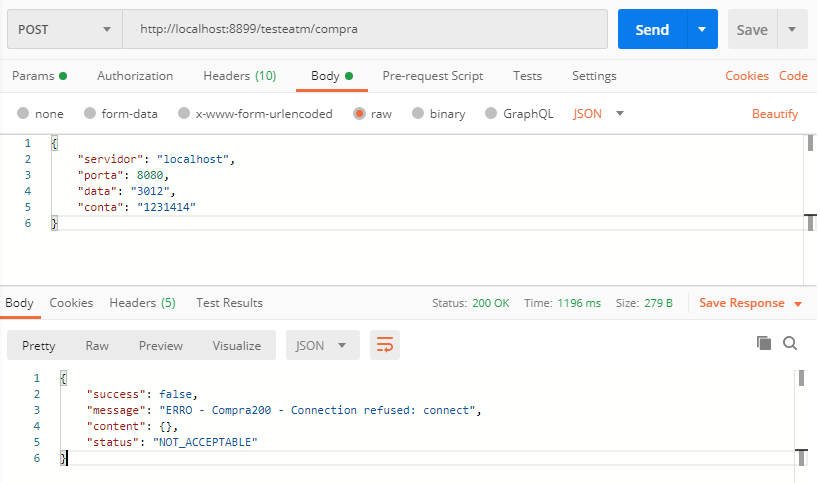

# Projeto para testes TOPAZ 

# Iniciar o servidor 
 Fazer o download do arquivo "testeAtm.jar" - na pasta /build, após clicar duaz vezes neste arquivo para executar, para conferir se iniciou o servidor de teste, podemos olhar no Gerenciador de Tarefas 

# Finalizar o servidor 
   Abrir o Gerenciador de Tarefas e clicar no botão "Finalizar Tarefa" na tarefa Java, como mostra a imagem.
   

# Executando as chamadas
  Criar uma chamada rest(POST) para o endereço - http://localhost:8899/testeatm/compra, criar um objeto no body com os parâmetros  
  {
  	"servidor": "localhost",
    "porta": 8080,
    "data": "1230",
    "conta": "1234157"
  }
  
 
 
 
 # Tratamento de Erros
 
 
 
 # Serviços Mapeados 
  
 1-Compra - http://localhost:8899/testeatm/compra 

2- Compra y Reversa - http://localhost:8899/testeatm/compraReversa

3- Compra USD - http://localhost:8899/testeatm/compraUSD

4- Consulta Extrato - http://localhost:8899/testeatm/consultaExtrato

5- Consulta Saldo - http://localhost:8899/testeatm/consultaSaldo

6- Retiro - http://localhost:8899/testeatm/retiro

7- Retiro y reversa - http://localhost:8899/testeatm/retiroReversa
  
8- Saque Loja - http://localhost:8899/testeatm/saqueLoja

9- Saque Loja Reversa - http://localhost:8899/testeatm/saqueLojaReversa
  
